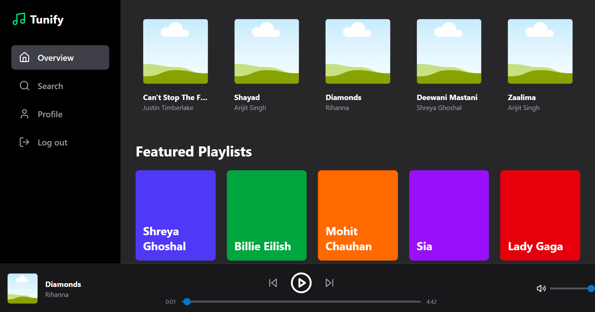

# Tunify - Full-Stack Music Streaming Platform

<p align="center">
  
</p>

**Tunify** is a complete, full-stack music streaming web application built with the MERN stack (MongoDB, Express.js, React, Node.js). It features a sleek, modern user interface, robust backend services, and role-based access control for users and administrators. The platform allows admins to populate the music library by downloading MP3s directly from YouTube URLs, while users can stream music, browse playlists, and search the entire collection.

---

## ✨ Key Features

### User-Facing Features
- **Seamless Music Playback:** A persistent, site-wide audio player allows for uninterrupted music while navigating the app.
- **Dynamic Content:** The landing page features a random selection of popular songs and featured playlists fetched from the backend.
- **Robust Search:** Users can search for songs and playlists in real-time with a debounced search for a smooth experience.
- **Playlist Exploration:** View detailed playlist pages with a list of all included tracks.
- **Endless Radio Mode:** When a short playlist or search result queue ends, the player automatically fetches and plays new random songs.
- **Secure Authentication:** A responsive, animated login and registration system using JWT for secure access.
- **Profile Management:** Users can view their profile and update their username and password.

### Admin-Exclusive Features
- **Admin Dashboard:** A dedicated, protected route for administrators to manage the application's content.
- **YouTube to MP3 Downloader:** Admins can add new songs to the library simply by providing a YouTube URL. The backend handles the download and conversion to MP3 using `yt-dlp` and `FFmpeg`.
- **Content Management:**
    - **Create & Delete Playlists:** Admins can create new playlists and delete existing ones.
    - **Manage Songs:** Admins can delete songs, which also removes the corresponding MP3 file from the server and removes the song from all playlists.
    - **Playlist Curation:** A user-friendly interface with searchable dropdowns to add songs to playlists or remove them.

---

## 🛠️ Tech Stack & Architecture

This project follows a modern MERN stack architecture, separating the frontend client from the backend API for scalability and maintainability.

### Frontend
- **React (Vite):** A fast, modern framework for building the user interface.
- **React Router:** For client-side routing and navigation.
- **Tailwind CSS:** For utility-first styling and a responsive design.
- **Axios:** For making HTTP requests to the backend API.
- **Lucide React:** For a clean and consistent icon set.
- **React Context API:** For global state management of authentication, music data, and the audio player.

### Backend
- **Node.js:** A JavaScript runtime for the server.
- **Express.js:** A web application framework for building the RESTful API.
- **MongoDB:** A NoSQL database for storing user, song, and playlist data.
- **Mongoose:** An ODM for modeling and interacting with MongoDB.
- **JSON Web Tokens (JWT):** For secure user authentication and session management.
- **bcrypt.js:** For hashing user passwords before storing them.
- **`yt-dlp` & `FFmpeg`:** External tools executed via Node.js's `child_process` to handle downloading and audio conversion.
- **CORS:** To enable cross-origin requests from the frontend.

---

## 🚀 Getting Started

To get a local copy up and running, follow these simple steps.

### Prerequisites
- Node.js (v18 or later)
- npm
- MongoDB (local instance or a cloud service like MongoDB Atlas)
- **`yt-dlp`** and **`FFmpeg`** must be installed on your system and accessible in your system's PATH.

### Installation & Setup

1.  **Clone the repository:**
    ```sh
    git clone "https://github.com/Sandesh-projects/music-app"
    cd tunify
    ```

2.  **Setup the Backend:**
    ```sh
    cd backend
    npm install
    ```
    - Create a `.env` file in the `backend` directory and add the following variables:
      ```env
      MONGO_URI=your_mongodb_connection_string
      JWT_SECRET=your_super_secret_key
      PORT=3001
      ```

3.  **Setup the Frontend:**
    ```sh
    cd ../frontend
    npm install
    ```

### Running the Application

1.  **Start the Backend Server:**
    ```sh
    cd backend
    npm run dev
    ```
    The server will be running on `http://localhost:3001`.

2.  **Start the Frontend Development Server:**
    ```sh
    cd frontend
    npm run dev
    ```
    The application will be available at `http://localhost:5173` (or another port if 5173 is busy).

3.  **Create an Admin User:**
    - To use the admin features, you first need to create an admin account.
    - Open the `backend/createAdmin.js` file and set your desired admin credentials.
    - Run the script from the `backend` directory:
      ```sh
      node createAdmin.js
      ```

---

## 📄 API Endpoints Overview

### Authentication (`/api/auth`)
- `POST /register`: Create a new user account.
- `POST /login`: Log in and receive a JWT.
- `GET /profile`: Get the profile of the currently logged-in user.
- `PATCH /update-username`: Update the user's username.
- `PATCH /update-password`: Update the user's password.

### Music (`/api/music`)
- `GET /songs/random`: Get a random selection of songs.
- `GET /playlists/random`: Get a random selection of playlists.
- `GET /search`: Search for songs and playlists by a query string.

### Admin (`/api/admin`)
- `POST /song`: Add a new song from a YouTube URL.
- `DELETE /song/:id`: Delete a song and its associated file.
- `POST /playlist`: Create a new playlist.
- `DELETE /playlist/:id`: Delete a playlist.
- `PATCH /playlist/add-song`: Add a song to a playlist.
- `PATCH /playlist/remove-song`: Remove a song from a playlist.
- `GET /playlist/:id`: Get the full details of a single playlist.

---
